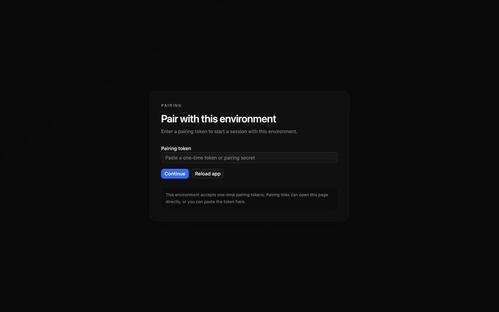
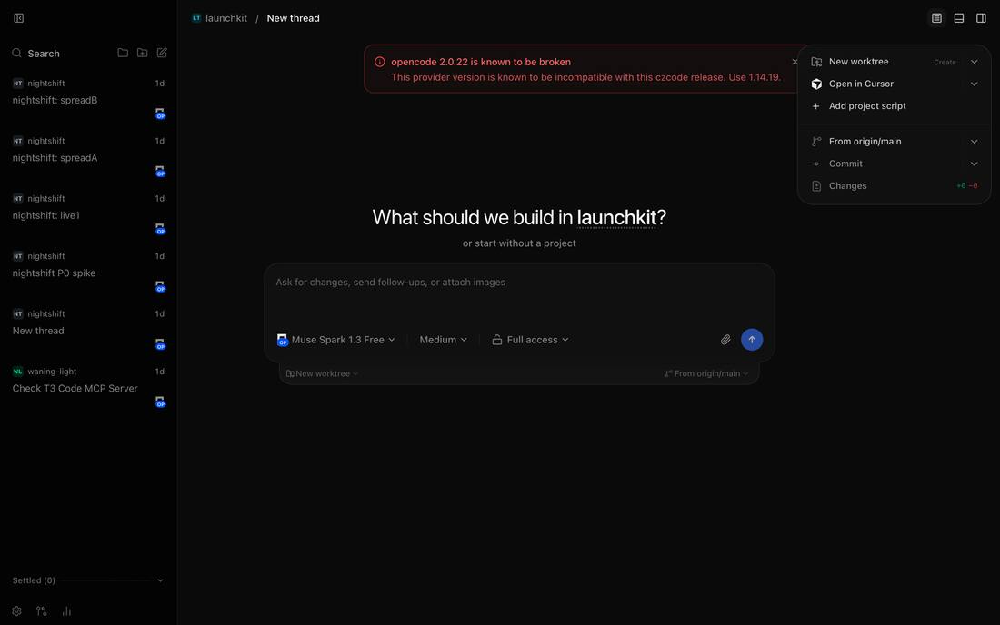
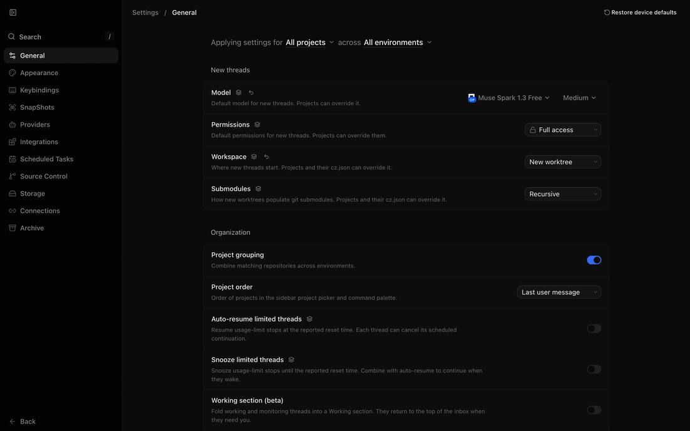
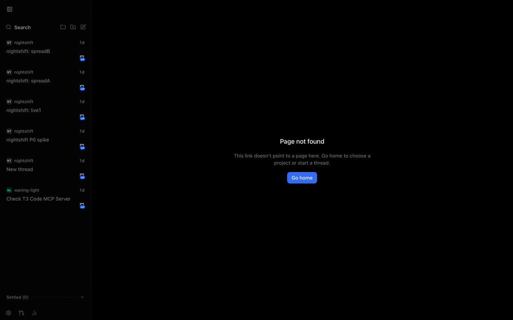
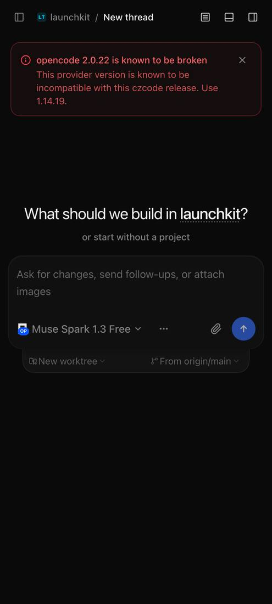
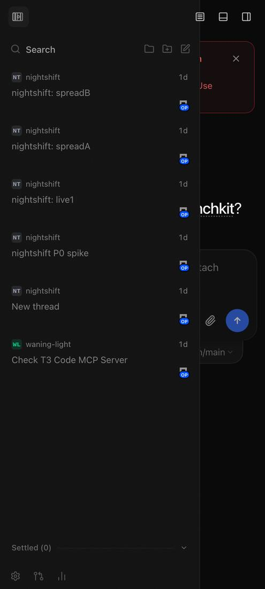
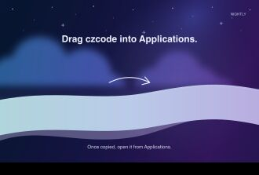

# P1: rename

Everything T3 is renamed by the codemod in `ccez/rename/`, and the
fork-only edits are on `main`.

## Built

- **Codemod** (`ccez/rename/`): rule table derived from one `identity`
  config, deterministic, ~8 s over ~24k files. It rewrites text and paths,
  patches same-length names compiled into vendored wasm, masks base64
  runs, re-hashes changed pnpm patches, re-serializes the lockfile, and
  formats with the repo's own formatter. `check` fails on any T3 name
  outside the allowlist (LICENSE, NOTICE, `ccez/`, and the one
  legacy-names module).
- **Upstream flow**: branch `upstream-cz` = codemod of `upstream/main`,
  one commit per sync; `sync.sh` regenerates it, merges it into `main`,
  re-drops dropped paths on conflicts, keeps README/LICENSE (`merge=ours`),
  and runs the check. Exercised three times; the last brought in new
  upstream commits with no conflicts.
- **Legacy carry-over** (`packages/shared/src/legacyNames.ts`):
  `T3CODE_*` env vars are adopted as `CZ_*` with a warning. On the first
  run, `~/.t3` is copied to `~/.cz` (SQLite via `VACUUM INTO`, consistent
  even with T3 running; runtime, caches, logs, worktrees, and Connect
  tokens are skipped; staged, then renamed into place). The project
  loader falls back to `t3.json`.
- `apps/marketing` removed; **PostHog removed** (the service keeps its
  interface and drops every event; the hashed install id is gone; mobile no
  longer defaults traces to Axiom).
- **No branding in the UI**: the titlebar brand, welcome wordmark, home
  header, auth eyebrows, mobile header lockup, loading-screen icon, "About
  czcode", the DMG logo, and "czcode" in the main empty states and notices
  are gone. Release builds are titled plain "czcode" (window title and
  launcher only). The wordmark component draws a neutral dot where upstream
  used it as an icon.
- Placeholder launcher icon on every surface (`ccez/brand/apply.sh dot`).
- README rewritten; NOTICE added; owner line added to LICENSE.

## Gate results

- `ccez/rename/check`: **pass**, no T3 names outside the allowlist.
- Typecheck, all 15 workspaces: **pass**.
- Tests: the renamed tree fails exactly the tests that fail on untouched
  upstream on this Mac. Those are macOS `/private/var` symlink cases,
  swiftc sanitizer builds, Firefox-profile lock timeouts, web
  prompt-stash/snooze locale cases, and desktop update/window suites that
  time out only under parallel load (they pass alone). Codemod bugs the
  suite caught and fixed: org/owner splits, `\n`-escaped tokens, URL-encoded
  tokens, team-prefixed bundle ids, `T3-code` / `t3_code` / `T3_CODEX_*`,
  the Gradle scope slug, and the wasm import name.
- Mobile static check: ran. swiftlint/ktlint/detekt are not installed on
  this Mac, so those linters were skipped. The Android build below
  compiles all Kotlin.
- **Android dev build**: `uk.ccez.cz.dev`, label "czcode Dev", builds
  clean (`assembleDebug`). **Not yet on the S24**: no device was on USB or
  the tailnet.
- **`cz serve` keeps existing threads**: on a snapshot of the real
  `~/.t3` in a scratch HOME, the first `cz` run printed "Copied ~/.t3 to
  ~/.cz". Thread tables matched row for row (activities 41/41, messages
  8/8). The server then booted on a sanitized copy and listed the migrated
  threads.
- Screenshots (web, desktop size and phone size): no name, logo, or
  wordmark inside the UI.

  
  
  
  
  
  
  
  

## Not verified yet (needs the owner)

- The dev build on the S24 (launcher, splash, notification, About
  screenshots).
- The Mac desktop app window. It would open a window on the owner's screen,
  so I'm asking first. The renderer is the web app shown above.
- Settings descriptions still use the name in about 60 sentences ("Restart
  czcode to finish…"). The plan's no-name list covers the chrome, welcome,
  empty states, About, and notifications, which are done. Rewording every
  settings sentence would conflict on each upstream sync.
