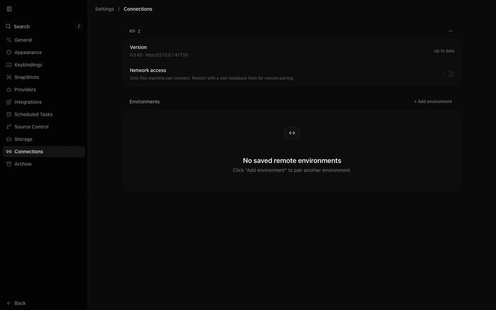

# P2: Tailscale only

No hosted middleman: devices reach each machine directly over Tailscale
(`cz serve --tailscale-serve`, then `cz pair --tailscale` per device).
Both commands come from upstream, renamed.

## Built

- Every Connect gate is false regardless of build config (web, mobile,
  server, CLI auth), so Clerk never loads and no relay session can start.
- Removed: the relay Worker (`infra/relay`), its deploy workflow, the
  alchemy toolchain only it used, and the Connect, relay, and push docs.
  Also removed: the managed-auth shell, Connect sign-in in settings and
  onboarding, link, onboarding, and CLI-auth dialogs, the `/connect` route,
  Connect rows in Connections, the desktop Clerk bridge and passkeys, and
  the mobile Clerk provider, account, and onboarding screens. Relay push
  registration is gone (Notifications now says push is off), as is
  `cz connect`. **All `@clerk/*` packages are gone** (lockfile −2,600
  lines). `map.ts` lists the dropped paths so upstream edits stay out.
- Kept as dormant code: the client-runtime relay transport and the
  server's tunnel/link plumbing. Both sit behind the always-false gate and
  can't run without Clerk. Removing them means rewriting the shared
  connection layer and upstream's busiest server file, which would
  conflict on every weekly sync.

## Gate results

- **No request to any T3 host.** The built server ran on migrated data
  through a logging proxy, and a browser walked the home screen, settings,
  Connections, Usage, and Providers:
  - Browser: one host only, the cz server itself (1,502 requests).
  - Server outbound hosts: chatgpt.com and api.anthropic.com (provider
    usage limits), registry.npmjs.org and github.com (provider version
    checks), api.bitbucket.org (source-control detection), and
    mcp.cloudflare.com / docs.mcp.cloudflare.com (MCP servers in the copied
    settings). analytics.brew.sh comes from a Homebrew subprocess, not cz.
    No relay, Clerk, PostHog, Axiom, or T3 domain.

  

- Typecheck: pass. Android dev APK without Clerk: builds.

## Needs the owner

- Pairing the phone with each host over Tailscale, off home Wi-Fi, and
  starting an agent on each. Right now only the Mac is on the tailnet; the
  phone and the two Windows PCs need Tailscale and `cz serve
--tailscale-serve` (PLAN.md, "Home machines").
- Upstream's load balancing for new threads is kept as-is (Connections →
  Load balancing). It needs the second and third hosts paired to show
  anything.
