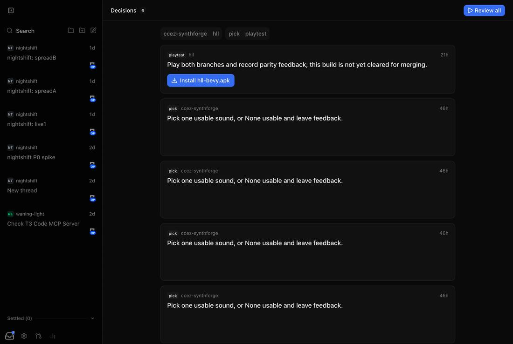
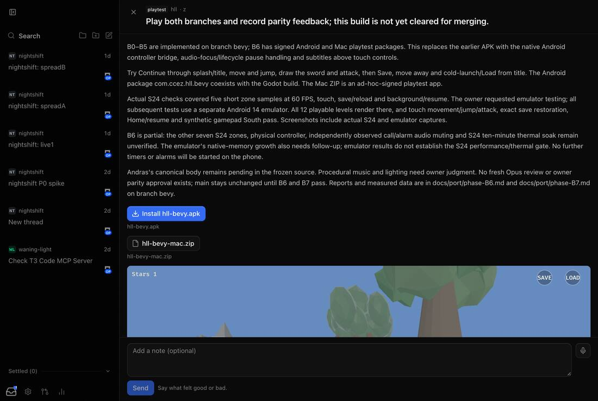
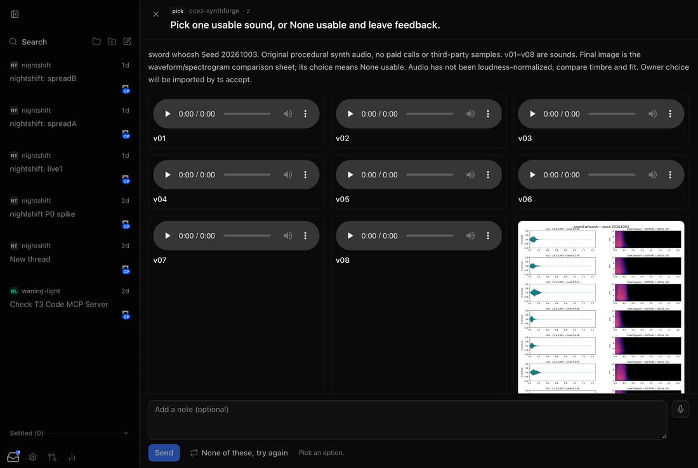
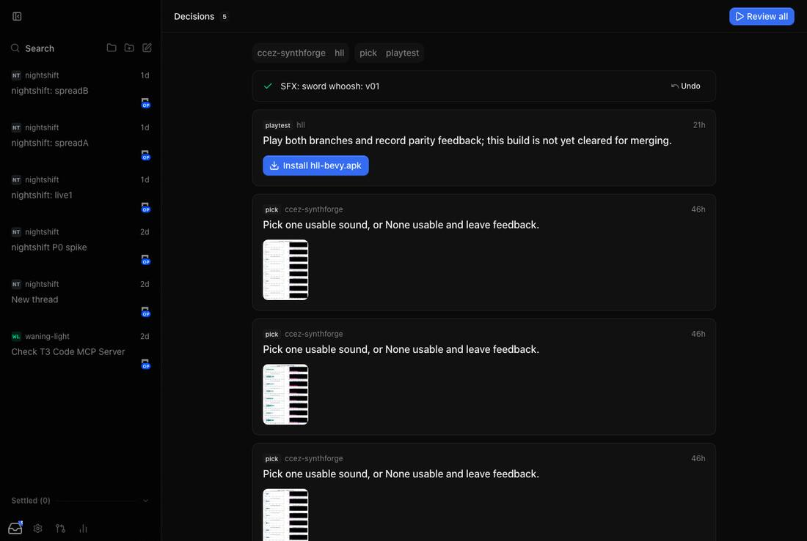
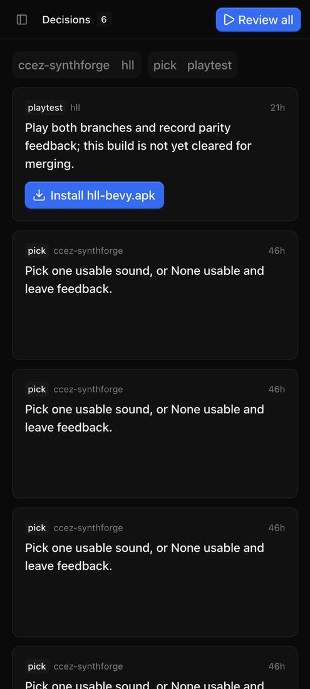

# P4: The Decisions tab

One feed of every open decision from every paired machine, on web,
desktop, and Android.

## Built

- **Shared** (`packages/client-runtime`): the decisions HTTP client and
  atoms (each host is re-read every 15 seconds), feed ordering (blocking
  first, then priority, then age), filters, and the draft-to-answer rules,
  so web and mobile agree on what counts as a valid answer.
- **Web and desktop:** a sidebar Decisions entry with a count, plus the feed
  with project and kind chips and cards that answer in one tap
  (review/pitch verdicts, image picks). There's also a review session that
  steps through every open item, and a full view for each kind:
  - **Pick:** one or many; audio options play in place.
  - **Review:** verdicts, redlines drawn on the image.
  - **Listen:** keep/kill/favourite, loop, more like these.
  - **Look:** `<model-viewer>` 4.3.1 (Apache-2.0) with orbit, animations,
    and a clay view.
  - **Read:** passage comments.
  - **Playtest:** install link plus the feedback form.
  - **Rank, Pitch, Request:** upload, type, or record.
  - **Timeline:** redo from a step.
  - Answers wait 5 seconds with Undo before they send.
- **Android:** the same feed and views in Expo (expo-audio, expo-video, and
  model-viewer in a WebView), with APK install through the system
  installer and a toolbar button on the threads list.

## Gate results

| Feed                          | Pick view                       | Review view                     |
| ----------------------------- | ------------------------------- | ------------------------------- |
|  |  |  |

| Answered, with undo               | Phone-width web                |
| --------------------------------- | ------------------------------ |
|  |  |

- I walked the web feed and views with Playwright on imported real items
  (desk and phone widths), with no page errors.

## Not done

- Per-kind Playwright and Maestro test suites.
- The owner answering one of each kind on the S24.
- inbox.ccez.uk is shut down (2026-10-05). The owner had never answered an
  item and kept nothing, so there was no import. The Worker and its D1
  database are deleted. The R2 bucket `ccez-inbox-media` has a rule
  expiring every object after a day; once it's empty, run
  `npx wrangler r2 bucket delete ccez-inbox-media`. The inbox.ccez.uk
  Access application in the Zero Trust dashboard can go too.
