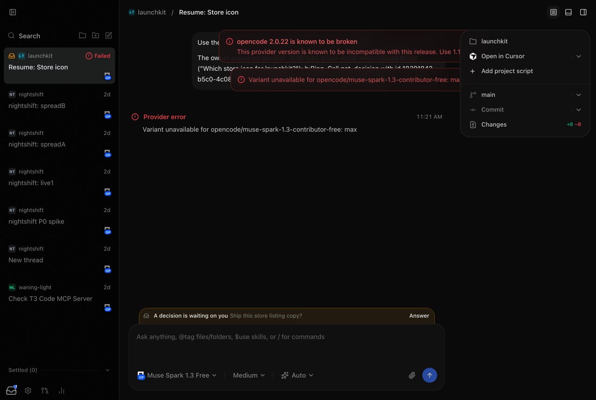
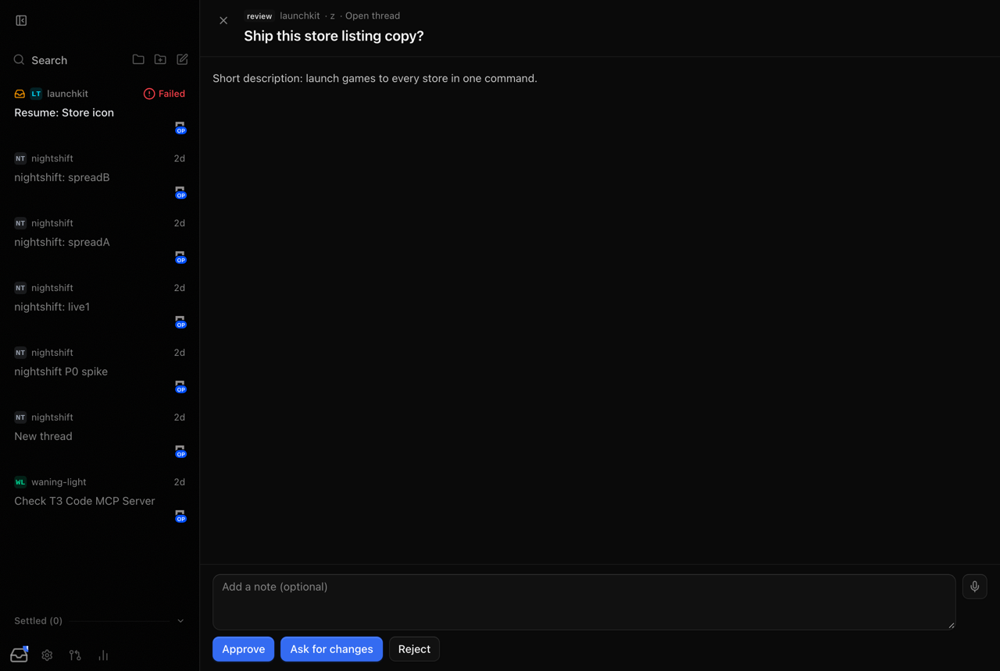
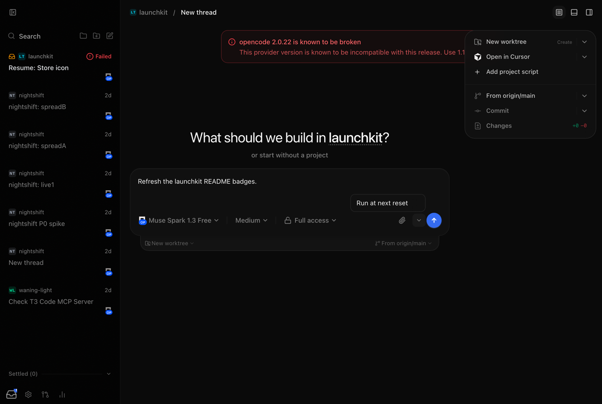
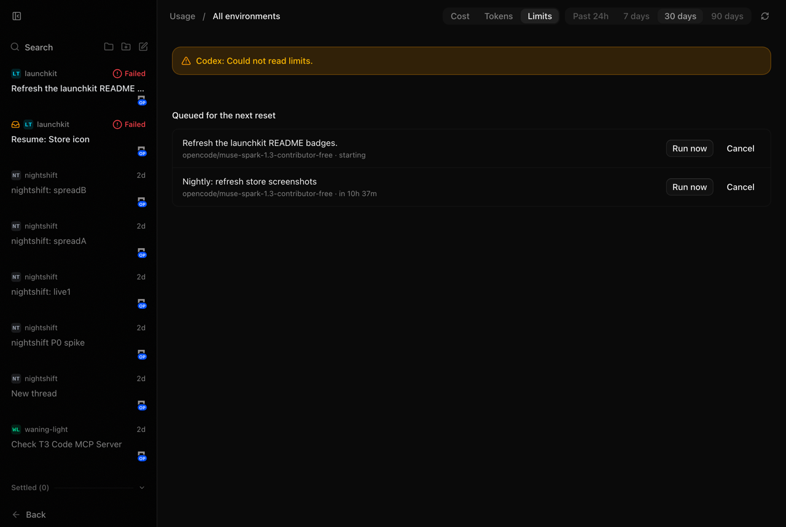

# P5: Links, resume threads, and the reset queue

Answers now lead somewhere: a thread shows the decisions it asked, a
decision links back to its thread, and an answer to an agent that moved on
starts a resume thread. nightshift's queue now lives in the server as the
reset queue. `~/SWE/nightshift` is deleted; its history is on GitHub.

## Built

- **Reset queue** (`apps/server/src/resetQueue`). It keeps runs in `cz.sqlite` and
  polls every 30 seconds. Due runs start as ordinary threads through
  `ThreadLaunchService`. Start time:
  - When nothing is spent: the soonest window reset.
  - When a window is spent: once every spent window has reset, so a spent
    weekly window outranks the session reset.
  - Within 45 minutes of a reset with allowance left, queued runs start
    early instead of letting it expire unused (nightshift's "burn" rule).
  - A model that reports no reset time (OpenCode's free models) starts now,
    as nightshift did for uncapped providers, and the UI says so.
- **Where it shows:**
  - `/api/queue` lists, enqueues, cancels, and starts runs now.
  - `cz queue add|list|cancel|run-now` talks to the running server.
  - Web: "Run at next reset" in a menu beside send on new threads.
  - Android: long-press send for the same option.
  - Web and Android: the queue under Usage → Limits, with Run now and Cancel.
- **Follow-ups** (`decisions/DecisionFollowUps.ts`):
  - An approved pitch is queued for the next reset.
  - A non-blocking answer with a resume plan starts a resume thread now if
    quota allows, otherwise at the reset. The prompt carries the answer and
    the decision id.
  - The project is matched by id, path, title, or folder name.
  - The model is the asking thread's, then the project default, then the
    settings default, then the provider default.
  - Each decision gets at most one run (a unique index), and the last day's
    answers are re-checked on boot.
- **Links:**
  - The thread shows a banner ("A decision is waiting on you · Answer"),
    and Answer deep-links to `/decisions?open=…`.
  - The sidebar or thread list marks threads with open decisions.
  - A decision shows "Open thread". Android has all three.
- Fork data moved from `decisions.sqlite` to `cz.sqlite` so the queue shares
  it. No owner install had the old file.

## Gate results

Built server, a sandbox copy of real data, browser driven by Playwright:

- **Resume:** I submitted a non-blocking pick with a resume plan from
  `cz inbox`, then answered it in the browser. A `resume` run started at
  once, as a new launchkit thread whose first message holds the answer.
  Its turn then failed on the sandbox's OpenCode 2.0.22, which cz flags as
  broken. That is provider state, not the queue.
- **Queue:** I queued from `cz queue add --at` and from the composer menu.
  Both appear under Usage → Limits.
- **Links:** the thread banner, sidebar marker, deep-link, and Open thread
  all rendered.
- Tests: queue timing, cancel, run now, failed launch, follow-up rules,
  project and model matching, and the label wording (20 tests).

| Thread banner + sidebar marker  | Answer deep-link                |
| ------------------------------- | ------------------------------- |
|  |  |

| Run at next reset               | Queue on Usage → Limits       |
| ------------------------------- | ----------------------------- |
|  |  |

## Not verified

- **Android:** typechecked only. The long-press, queue section, banner,
  and marker need an APK build on the S24.
- **"Starts after the reset at night":** covered by tests with a fake
  clock, not by waiting a night on real quota.

## Deviations

- "The thread is created now but starts at the reset" became "the run
  waits in the queue and becomes a thread when it starts". Creating an
  idle thread first would need an orchestration change upstream doesn't
  have.
- Queued runs carry text only. Attachments and context make the composer
  hide the option instead of dropping them silently.
