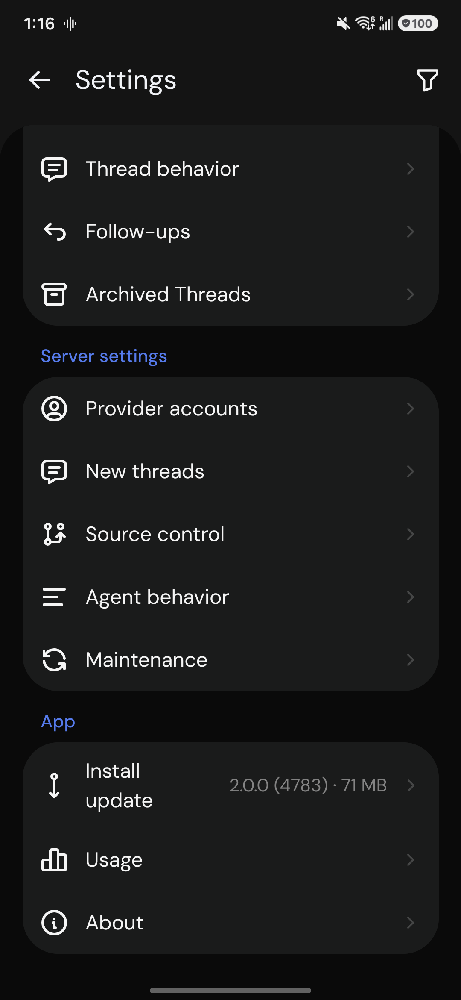
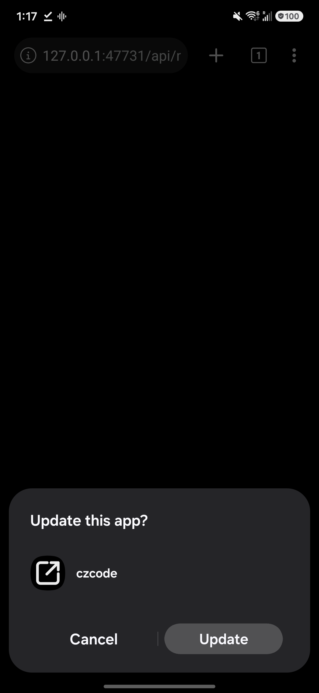

# P6: Ship

cz installs on the Mac and the S24 from this repo, and both update from it.
No store, no Apple Developer ID, no GitHub releases.

## Built

- **Android updates from the owner's own server.**
  - `ccez/release/android.sh` stamps the commit count as the versionCode, so
    each build installs over the last.
  - `android.sh --publish` copies the APK to `~/.cz/releases/android/`.
    The Mac's cz server offers it at `/api/mobile-release/android`, with a
    signed one-hour download URL.
  - On the phone, **Settings → App → Install update** appears when a paired
    machine has a newer build. Tapping it downloads the APK in the browser,
    which hands it to the system installer.
- **Mac desktop app:** `ccez/release/mac.sh` builds the unsigned arm64 app.
  - The build has no update feed, because an unsigned app can't apply
    updates from one. Updating means running the script again on a newer
    `main`.
  - `--install` replaces `/Applications/czcode.app` and writes
    `~/.local/bin/cz`. That command runs the installed app's own server, so
    `cz inbox`, `cz queue`, and `cz serve` always match the app.

- **New agent hosts:** `ccez/hosts/windows.ps1` and `ccez/hosts/linux.sh`.
  - On a Windows PC, `windows.ps1` (run in an administrator PowerShell)
    installs WSL2 with Ubuntu, turns on systemd, and keeps WSL running
    after logon. Then it runs `linux.sh` inside WSL.
  - `linux.sh` also works alone on plain Ubuntu. It installs git, `gh`,
    Vite+ (which brings Node), and Tailscale. It builds cz from this repo
    and runs `cz serve` as the systemd user service `cz-host`, on the
    tailnet through Tailscale Serve.
  - It installs Claude Code, Codex, and OpenCode, walks through each login,
    and prints a pairing link.
  - Re-running it skips finished steps and updates cz.
  - Hosts run cz from a source checkout instead of upstream's release
    archives, because the fork publishes no releases.

## Switch-over

Do this with the owner, when no T3 agent is mid-turn:

1. Quit T3 Code.
2. Run `ccez/release/mac.sh --install`, then open czcode from Applications.
   It copies `~/.t3` to `~/.cz` on first launch, but only if `~/.cz` doesn't
   exist yet. Check that projects and threads are there. (A stale Oct 4 copy
   from P1's desktop test was deleted on 2026-10-05. Until the switch, run
   nothing that creates `~/.cz`, including `android.sh --publish` without
   `CZ_HOME`.)
3. On the S24, pair with the Mac (Settings → Environments), then run
   `ccez/release/android.sh --publish` once to try Install update.
4. Use only cz for three days, and fix what breaks.

To roll back, quit czcode and open T3 Code. `~/.t3` is left untouched.

## Gate results

- **Install update on the S24** (2026-10-05). The phone had build 4782 over
  USB. A sandbox server offered the same APK, labelled build 4783. Settings
  showed **Install update · 2.0.0 (4783)**. Tapping it downloaded the full
  71 MB in the phone's browser. That browser warns on any APK
  ("might be harmful", then "Download anyway"). Opening the download
  brought up Android's "Update this app?" for czcode, and Update installed
  it (`lastUpdateTime` 13:17:27). No extra permission prompt appeared,
  because the browser already had install permission.
- **Mac:** `mac.sh` built `Czcode-0.0.45-arm64` with no `app-update.yml`.
  It's installed in `/Applications`, and `cz --version` (the shim) prints
  v0.0.45. The first `cz` run copied `~/.t3` to `~/.cz`. T3 wasn't running,
  so the copy is consistent. That was the switch-over. T3's apps, data, and
  caches then went to the Trash (`t3-removed-2026-10-05`).

| Install update                       | System installer                |
| ------------------------------------ | ------------------------------- |
|  |  |

## Not done

- `windows.ps1` and `linux.sh` haven't run on a real Windows PC or Ubuntu
  machine yet. Shellcheck passes, but nothing was available here to run
  them on.
- The owner using only cz for three days.
